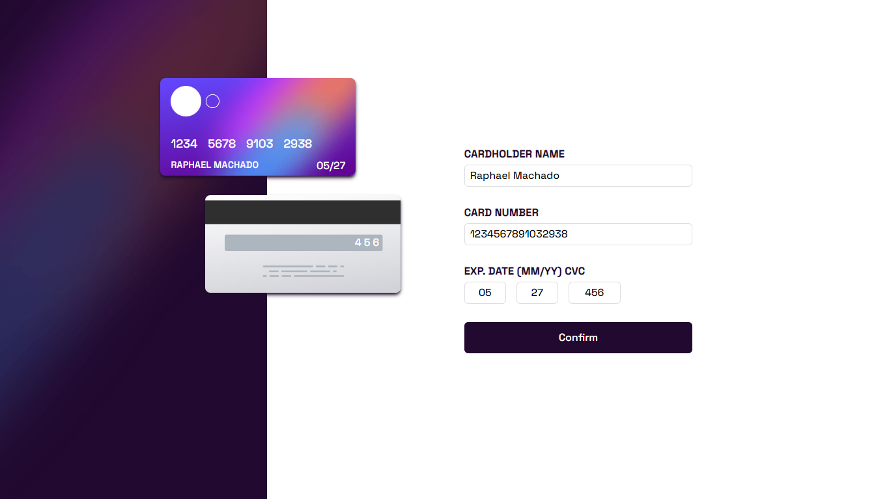

# Frontend Mentor - Interactive card details form solution

This is a solution to the [Interactive card details form challenge on Frontend Mentor](https://www.frontendmentor.io/challenges/interactive-card-details-form-XpS8cKZDWw). Frontend Mentor challenges help you improve your coding skills by building realistic projects.

## Table of contents

- [Overview](#overview)
  - [The challenge](#the-challenge)
  - [Screenshot](#screenshot)
  - [Links](#links)
- [My process](#my-process)
  - [Built with](#built-with)
- [Author](#author)
- [Run your machine](#run-local)

## Overview

### The challenge

Users should be able to:

- Fill in the form and see the card details update in real-time
- Receive error messages when the form is submitted if:
  - Any input field is empty
  - The card number, expiry date, or CVC fields are in the wrong format
- View the optimal layout depending on their device's screen size
- See hover, active, and focus states for interactive elements on the page

### Screenshot

### Links

- Solution URL: [Add solution URL here](https://www.frontendmentor.io/solutions/interactive-card-details-with-tailwindcss-and-react-MqQ8iCFotg)
- Live Site URL: [Add live site URL here](https://interactive-card-rm0909.netlify.app)

## My process

### Built with

- React
- Mobile-first workflow
- Vite
- [React](https://reactjs.org/) - JS library
- [tailwindcss](https://tailwindcss.com/) - CSS Framework

## Author

- Frontend Mentor - [@rm0909](https://www.frontendmentor.io/profile/rm0909)

### Run Local

To run the project in your machine

- npm install
- npm run dev
